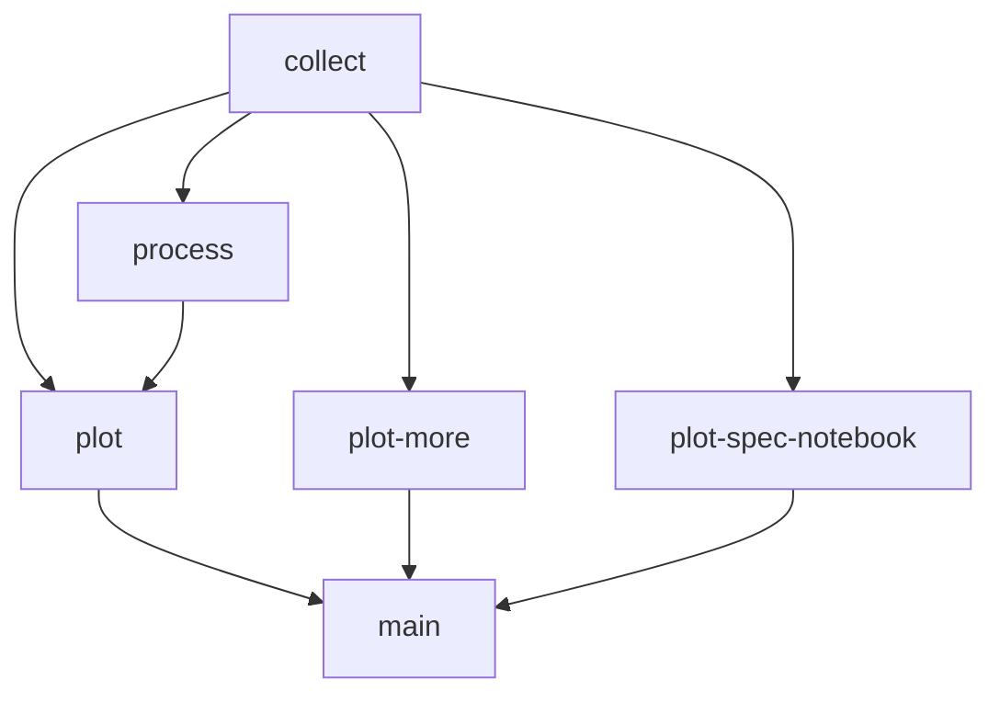

# Calkit `xr` demo

A demo project showing how to _automatically automate_ multilingual
scientific workflows using the `calkit xr` (execute-and-record) command.

The scripts, notebooks, and paper directories existed beforehand.
Each was run in the _system_ environment so dependencies were not tracked
here in the project.

Each process was then run individually:

```sh
calkit xr scripts/collect.py
```

```sh
calkit xr scripts/process.jl
```

```sh
calkit xr scripts/plot.R
```

```sh
calkit xr scripts/plot_more.m
```

```sh
calkit xr notebooks/plot-spec.ipynb
```

```sh
calkit xr paper/main.tex
```

This automatically recorded a "virtual environment" and
[pipeline](https://calkit.io/petebachant/calkit-xr-demo/pipeline)
stage for each and added them to [`calkit.yaml`](calkit.yaml).

The project is now a directed acyclic graph (DAG),
allowing everything to be brought up-to-date with a single command, skipping
steps that don't need to be rerun by monitoring changes to their environments,
input data files, and code:

```sh
calkit run
```



```
$ calkit run
Getting system information
Checking system-level dependencies
Checking environments
Compiling DVC pipeline
Stage 'collect' didn't change, skipping
Stage 'process' didn't change, skipping
Stage 'plot' didn't change, skipping
Stage 'plot-more' didn't change, skipping
Stage 'plot-spec-notebook' didn't change, skipping
Stage 'main' didn't change, skipping
Pipeline completed successfully ✅
```
